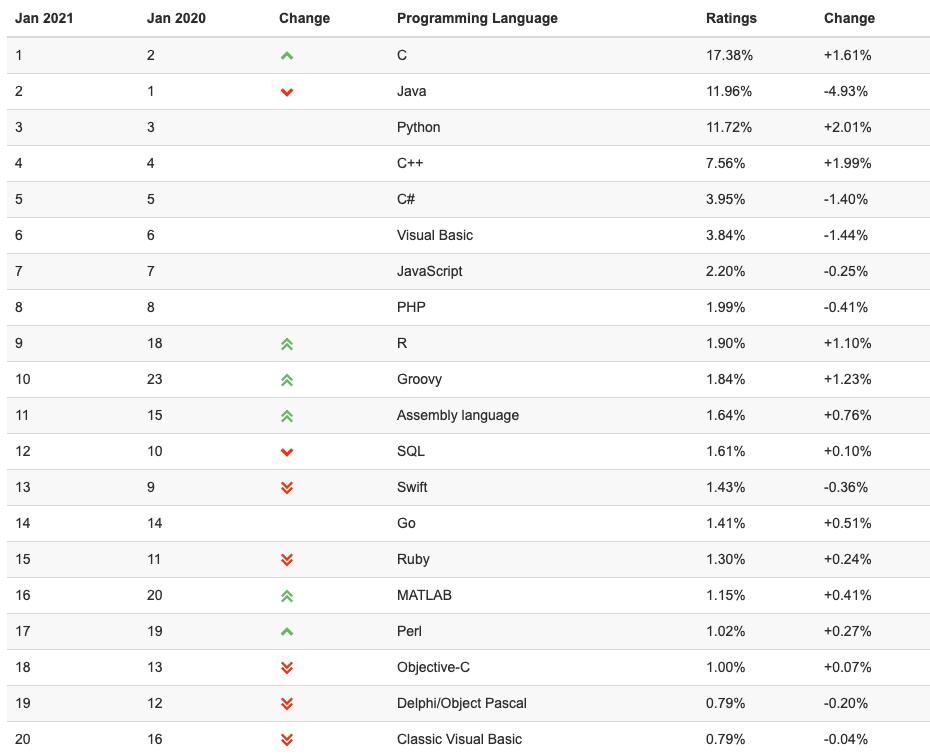

## 计算机语言的发展

​	   1、机器语言

​	最初的计算机所使用的是由“0”和“1”组成的二进制数，二进制是计算机的语言的基础。计算机发明之初，计算机只能被少部分人使用，人们需要用0、1组成的指令序列交由计算机执行，对于机器语言的使用与普及都是很令人头疼的问题。对于程序的移植能力几乎没有，从而时间成本，人力成本十分昂贵。但机器语言也不是没有优势，由于这种语言是直接对计算机硬件进行操作，所以在特定型号的计算机上面，运算效率也是很高的，机器语言的出现对于未来的计算机语言发展起到了很好的推动作用，所以机器语言也是第一代计算机语言。

　　2、汇编语言

　　汇编语言是在机器语言的基础上诞生的一门语言，用一些简洁的英文字母、符号串来替代一个特定的指令的二进制串，这也提高了语言的记忆性和识别性。对于程序的开发与维护起到了积极作用。汇编语言同样也是直接对硬件进行操作，这样依然局限了它的移植性。但是使用汇编语言针对计算机特定硬件而编制的汇编语言程序，对于计算机硬件的功能和特长的发挥已有了很大进步，它精炼而质量高，所以至今仍是一种常用的程序开发语言。

　　3、高级语言

　　从最初与计算机交流的痛苦经历中，人们意识到，应该设计一种这样的语言，这种语言接近于数学语言或人的自然语言，同时又不依赖于计算机硬件，编出的程序能在所有机器上通用。经过努力，1954年，第一个完全脱离机器硬件的高级语言—FORTRAN问世了，40多年来，共有几百种高级语言出现，有重要意义的有几十种，影响较大、使用较普遍的有FORTRAN、ALGOL、COBOL、BASIC、LISP、SNOBOL、PL/1、Pascal、C、PROLOG、Ada、C++、VC、VB、Delphi、JAVA等。高级语言的发展也经历了从早期语言到结构化程序设计语言，从面向过程到非过程化程序语言的过程。相应地，软件的开发也由最初的个体手工作坊式的封闭式？生产，发展为产业化、流水线式的工业化生产。

　　60年代中后期，软件越来越多，规模越来越大，而软件的生产基本上是人自为战，缺乏科学规范的系统规划与测试、评估标准，其恶果是大批耗费巨资建立起来的软件系统，由于含有错误而无法使用，甚至带来巨大损失，软件给人的感觉是越来越不可靠，以致几乎没有不出错的软件。这一切，极大地震动了计算机界，史称“软件危机”。人们认识到：大型程序的编制不同于写小程序，它应该是--项新的技术，应该像处理工程一样处理软件研制的全过程。程序的设计应易于保证正确性，也便于验证正确性。1969年，提出了结构化程序设计方法，1970年，第一个结构化程序设计语言一Pascal语言出现，标志着结构化程序设计时期的开始。

　　80年代初开始，在软件设计思想上，又产生了一次革命，其成果就是面向对象的程序设计。在此之前的高级语言，几乎都是面向过程的，程序的执行是流水线似的，在一个模块被执行完成前，人们不能干千别的事，也无法动态地改变程序的执行方向。这和人们日常处;理事物的方式是不一致的，对人而言是希望发生一件事就处理一件事，也就是说，不能面向过程，而应是面向具体的应用功能，也就是对象（object）。其方法就是软件的集成化，如同硬件的集成电路一样，生产一些通用的、封装紧密的功能模块，称之为软件集成块，它与具体应用无关，但能相互组合，完成具体的应用功能，同时又能重复使用。对使用者来说，只关心它的接口（输入量、输出量）及能实现的功能，至于如何实现的，那是它内部的事，使用者完全不用关心，C++、VB、Delphi就是典型代表。高级语言的下一个发展目标是面向应用，也就是说：只需要告诉程序你要干什么，程序就能自动生成算法，自动进行处理，这就是非过程化的程序语言。

下面我找了几个介绍：

[C](https://github.com/mqaaa/CS-INTOR/blob/main/%E5%9F%BA%E7%A1%80%E4%BF%A1%E6%81%AF/%E8%AF%AD%E8%A8%80%E7%89%B9%E7%82%B9%E4%B8%8E%E5%8F%91%E5%B1%95/C.md)、[C++](https://github.com/mqaaa/CS-INTOR/blob/main/%E5%9F%BA%E7%A1%80%E4%BF%A1%E6%81%AF/%E8%AF%AD%E8%A8%80%E7%89%B9%E7%82%B9%E4%B8%8E%E5%8F%91%E5%B1%95/C%2B%2B.md)、[Python](https://github.com/mqaaa/CS-INTOR/blob/main/%E5%9F%BA%E7%A1%80%E4%BF%A1%E6%81%AF/%E8%AF%AD%E8%A8%80%E7%89%B9%E7%82%B9%E4%B8%8E%E5%8F%91%E5%B1%95/Python.md)、[SQL](https://github.com/mqaaa/CS-INTOR/blob/main/%E5%9F%BA%E7%A1%80%E4%BF%A1%E6%81%AF/%E8%AF%AD%E8%A8%80%E7%89%B9%E7%82%B9%E4%B8%8E%E5%8F%91%E5%B1%95/SQL.md)、[MATLAB](https://github.com/mqaaa/CS-INTOR/blob/main/%E5%9F%BA%E7%A1%80%E4%BF%A1%E6%81%AF/%E8%AF%AD%E8%A8%80%E7%89%B9%E7%82%B9%E4%B8%8E%E5%8F%91%E5%B1%95/MATLAB.md)、[R](https://github.com/mqaaa/CS-INTOR/blob/main/%E5%9F%BA%E7%A1%80%E4%BF%A1%E6%81%AF/%E8%AF%AD%E8%A8%80%E7%89%B9%E7%82%B9%E4%B8%8E%E5%8F%91%E5%B1%95/R.md)

附录：

[2021.1计算机语言受欢迎度排名](https://www.tiobe.com/tiobe-index/)

#### 业内主流语言使用场景：

后端: Java、Go、Node.js、Python、PHP

前端：JS，HTML、CSS

数据分析：Python、SQL、R、MATLAB

机器学习：Python（但是底层学习逻辑大部分为C），但绝大多数人，仅在Python阶段

运维开发：Python、Go、Shell

大数据：Java

云计算：Java、Go

客户端：Swift、Objective-C、C#

